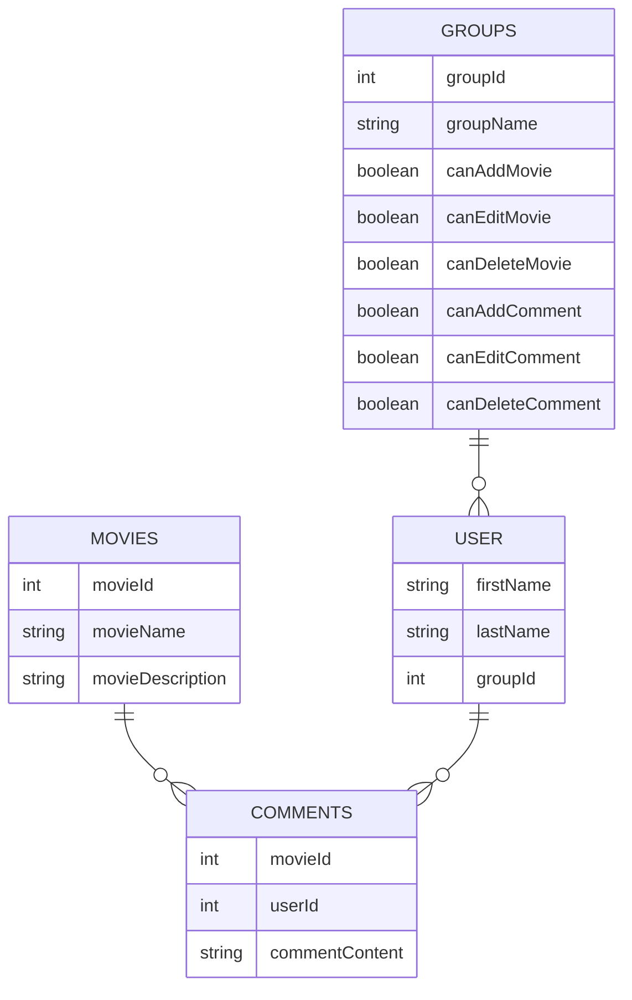

# Aplikacja internetowa "Baza filmowa"

Aplikacja będzie umożliwiać przeglądanie, dodawanie oraz edytowanie filmów zapisanych w bazie danych, oraz dodawanie, edycję oraz usuwanie komentarzy napisanych przez użytkowników.
Użytkownik niezalogowany będzie mieć możliwość przeglądania filmów oraz komentarzy.
Użytkownik zalogowany będzie mógł dodatkowo pisać, edytować oraz usuwać tylko własne komentarze.
Użytkownik z uprawnieniami administracyjnymi będzie mógł dodawać, edytować oraz usuwać zarówno filmy, jak i komentarze swoje oraz innych użytkowników.

## Diagram ERD

## Skład zespołu i podział prac

Oliwer Kucharzyk - backend \
Rafał Bobka - frontend
