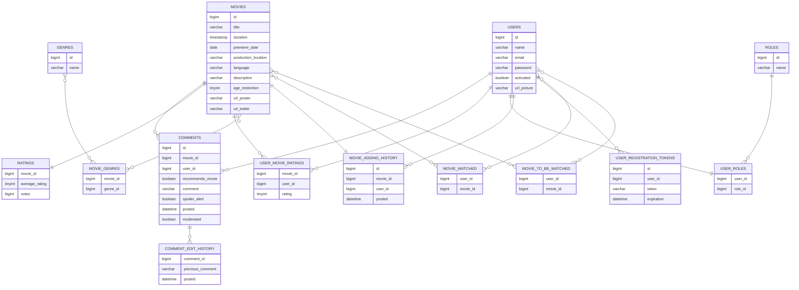

# Aplikacja internetowa "Baza filmowa"

Aplikacja będzie dawać dostęp użytkownikowi do zbiorów "Bazy filmowej", aby umożliwić odnalezienie interesujących dla użytkownika tytułów. 

Użytkownicy będą podzieleni na role USER oraz ADMIN. W zależności od posiadanej roli oraz tego czy dany użytkownik jest zalogowany w aplikacji będą dostępne określone funkcjonalności:
* Użytkownik niezalogowany będzie mieć możliwość wyłącznie przeglądania oraz filtrowania filmów oraz rejestracji.
* Użytkownik zalogowany będzie mógł dodatkowo oceniać oraz komentować filmy, a także edytować własne komentarze oraz dodawać filmy do listy "Do obejrzenia" oraz "Obejrzane". Ocenione filmy będą automatycznie dodawane do listy obejrzanych
* Administrator będzie mógł dodawać, edytować oraz usuwać filmy, a także zatwierdzać i moderować komentarze użytkowników.

Dodatkowo komentarze zawierające spoilery nie będą widoczne jawnie, ale dopiero po zgodzie użytkownika na wyświetlenie komentarza ze spoilerem (spoiler-alert). Możliwe będzie wyświetlenie historii edycji komentarza.

Średnia ocena filmu będzie wyliczana automatycznie na nowo po każdej nowej ocenie od pojedynczego użytkownika. 

Nowo zarejestrowani użytkownicy będą musieli aktywować swoje konto przechodząc link e-mail wysłany na maila.

Autoryzacja odbywać się będzie z wykorzystaniem tokenów JWT (nie uwzględnionych na poniższym diagramie).

## Diagram ERD

## Skład zespołu i podział prac

Oliwer Kucharzyk - backend \
Rafał Bobka - frontend

## Swagger info:

Aby podejrzeć dokumentację API otwórz stronę https://editor.swagger.io/ a następnie zaimportuj plik swagger.json dostępny w repozytorium. Docelowo dokumentcja będzie dostępna na serwerze hostującym API pod odpowiednim adresem URL.
